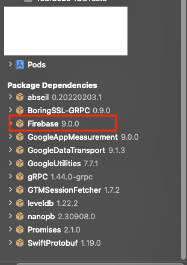

## Firebase Crashlytics With SPM

### 1. 準備專案GoogleService-Info.plist檔案

* [網址](https://console.firebase.google.com/)
* 下載GoogleService-Info.plist
* 

### 2. 複製GoogleService-Info.plist檔案到專案資料夾

* 

### 3. 安裝Firebase Crashlytics SDK

* 複製SDK網址`https://github.com/firebase/firebase-ios-sdk`[網址](https://firebase.google.com/docs/crashlytics/get-started?platform=ios)
* 在Xcode Swift Packages搜尋列貼上SDK網址, 執行搜尋
* 找到`firebase-ios-sdk`, 並點擊`Add Package`
* 
* 

* 選擇要安裝的`FirebaseAnalytics`, `FirebaseCrashlytics`套件, 並點擊`Add Package`
* 
* 

* 確認套件是否安裝成功
* 

### 4. 確認Analytics與Crashlytics套件是否加入專案Target

* 在Xcode前往Target`Build Phases`頁面
* 展開`Link Binary With Libraries`項目, 檢查是否有Analytics與Crashlytics套件
* 

### 5. AppDelegate配置Firebase

* 程式碼加入`FirebaseApp.configure()`
* 

### 6. 設定Debug Information Format[網址](https://firebase.google.com/docs/crashlytics/get-started?platform=ios#set-up-dsym-uploading)

* 在Xcode前往Target`Build Settings`頁面, 搜尋information
* 展開`Debug Information Format`選項, 將`Debug`格式調整為`DWARF with dSYM File`
* 

### 7. 設定Run Script[網址](https://firebase.google.com/docs/crashlytics/get-started?platform=ios#set-up-dsym-uploading)

* 在Xcode前往Target`Build Phases`頁面
* 點擊+號, 選擇`New Run Script Phase`, 命名為`Crashlytics Script`(依個人喜好)
* 

* 腳本填入`"${BUILD_DIR%/Build/*}/SourcePackages/checkouts/firebase-ios-sdk/Crashlytics/run"`
* Input Files填入`${DWARF_DSYM_FOLDER_PATH}/${DWARF_DSYM_FILE_NAME}/Contents/Resources/DWARF/${TARGET_NAME}`與`$(SRCROOT)/$(BUILT_PRODUCTS_DIR)/$(INFOPLIST_PATH)`
* 

### 8. 測試崩潰程式碼與日誌記錄結果

* 寫一段會崩潰的程式碼[網址](https://firebase.google.com/docs/crashlytics/get-started?platform=ios#force-test-crash), 並運行程式碼
* 等待幾分鐘, 前往Firebase Crashlytics頁面[網址](https://console.firebase.google.com/project/_/crashlytics), 觀看是否收到崩潰日誌
* 
